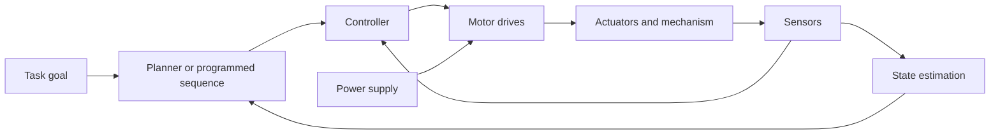

# From a Task to a Working System

“Pick up the object” sounds like a single instruction. A robot must turn it into several coordinated operations.

## Decompose the task

For a simple pick-and-place operation:

1. Establish where the object and destination are.
2. Select a suitable tool pose for grasping.
3. Find joint configurations that achieve the required tool poses.
4. Plan a path that respects obstacles and motion limits.
5. Execute the motion using actuator commands and feedback.
6. Close the gripper and check whether the grasp succeeded.
7. Transfer, release, and verify the placement.

### How does the robot know where the part is?

A **fixture** is a physical holder that keeps a part in a known position and orientation. Imagine a tray with one shaped pocket: every correctly seated part occupies approximately the same location. During setup, an operator measures or teaches that location relative to the robot's base. Establishing the relationship between measured locations and the robot's coordinates is part of **calibration**.

The robot can then reuse the stored pickup location on each cycle, provided the tray stays fixed and parts are seated as expected. It does not necessarily need to take a new camera image to locate each part. It may still use a sensor to confirm that a part is present.

If parts arrive at different positions on a conveyor, one stored location is insufficient. A camera or another sensor can estimate each part's current location before the robot approaches it. If the tray or robot base is moved, their calibrated relationship also needs to be re-established.

## Follow information and energy

A **sensor** measures a physical quantity. An **actuator** produces physical action. A **drive** converts control commands into electrical power delivered to a motor. A **controller** computes commands from desired behavior and available measurements. State estimation combines measurements and models to infer quantities that may not be measured directly.

Examples of measurements include joint angle from an encoder, contact force from a force sensor, and an image from a camera. Measurements have limitations: an encoder reports its own measured rotation, not a perfect measurement of the tool's location in the room.

## Actuator choices

A servo system uses feedback to regulate a quantity such as position, velocity, or torque. The term describes the feedback arrangement, not a single motor construction.

A stepper motor advances through commanded electromagnetic steps. It is often used without position feedback, but closed-loop stepper systems also exist. An open-loop system can lose track of actual position if commanded motion is not achieved.

Selecting an actuator involves load, speed, resolution, thermal limits, gearing, and control requirements. Sending a more precise number from software does not automatically produce more precise physical motion.

## Accuracy and repeatability

Suppose a tool is commanded to a coordinate of 100.0 mm. Three measured results are 101.9, 102.0, and 102.1 mm.

The readings are tightly grouped: their spread is small, suggesting good repeatability for this small illustrative sample. Their mean is 102.0 mm, giving a +2.0 mm mean error relative to the target. The system therefore shows a systematic offset despite producing similar repeated results.

- **Accuracy** concerns closeness to the intended or true value.
- **Repeatability** concerns agreement when an operation is repeated under specified conditions.
- **Resolution** is the smallest distinguishable measurement or command increment.

A fine encoder resolution does not eliminate calibration error, backlash, or deflection. Real performance evaluation also depends on load, speed, approach direction, and measurement conditions.

## Diagnose by following the chain

If the tool misses a part, check the chain of assumptions:

| Observation | Possible issue to investigate |
| --- | --- |
| Error is nearly constant | Frame alignment or tool calibration |
| Error changes with payload | Deflection or insufficient actuator effort |
| Joint readings track commands, but tool placement is wrong | Geometry, tool offset, or external position estimate |
| Gripper closes but object stays behind | Grasp pose, grip force, or tool suitability |

These observations narrow an investigation; they do not establish a unique cause.

## Quick reference

| Component | Role |
| --- | --- |
| Sensor | Measure |
| Estimator | Infer state from measurements and models |
| Planner | Choose a path or sequence |
| Controller | Compute commands to achieve desired behavior |
| Drive and actuator | Deliver power and produce motion |

[Previous](02-robots-manipulators-and-autonomy.md) · [Section index](README.md) · [Practice](exercises.md)
