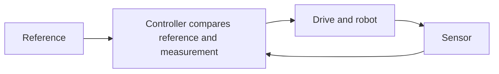

# Feedback and Control Layers

Kinematics predicts where a tool should be for a joint configuration. Control determines how the actuators should respond as the robot moves and encounters disturbances.

## Open-loop and servo control

An **open-loop** command does not use measurements of the controlled output to revise that command. For example, commanding a fixed motor voltage for a fixed duration without measuring resulting position does not establish that the desired distance was traveled.

A **servo** uses feedback to regulate a quantity such as position, speed, or force. With measured joint angle $q$ and desired angle $q_d$, define error as

$$
e=q_d-q.
$$

A simple proportional position controller producing torque is $\tau_{\mathrm{cmd}}=K_p e$. Here $K_p$ has units N·m/rad. For $e=0.1$ rad and $K_p=20$ N·m/rad, commanded torque is 2 N·m. This illustrates the error-to-command relationship; gravity, friction, damping, delays, and actuator saturation affect actual motion and stability.

## Feedback depends on the boundary you examine

A program can send a stored sequence of joint targets to motor servos. The joints use feedback even if the program never checks whether the object was grasped. That system is closed-loop at joint level and open-loop with respect to grasp success.

Likewise, a gripper command that changes in response to measured force or its rate of change contains sensory feedback. Even if an algorithm is called “adaptive open-loop,” describe its measured input, command output, and controlled variable before deciding which loop is open. A missing fixed force target does not remove the feedback path.

## High-level goals and low-level actuation

| Layer | Typical information passed onward | Example |
| --- | --- | --- |
| Task logic or planner | Target pose, path, or operation | Approach an object and close the gripper |
| Motion controller | Joint/task position or velocity references | Move the TCP downward at a specified speed |
| Joint controller and drive | Torque/current or voltage commands | Produce effort to track a joint reference |

These boundaries depend on the robot interface. A “move to pose” command may invoke several internal loops. Torque is mechanical effort; current often controls motor torque approximately through a motor constant. Voltage drives electrical dynamics and is not interchangeable with torque.

## Checkpoint and quick reference

An encoder measures position but software only logs it. Is the motion closed-loop? No: a measurement forms feedback only when it influences the command or relevant decision.

- Identify the controlled output before labeling a loop.
- Servo control requires feedback, not a particular motor construction.
- High-level references and low-level actuator commands are different quantities.

[Section index](README.md) · [Next: Position, paths, and trajectories](02-position-paths-and-trajectories.md)
