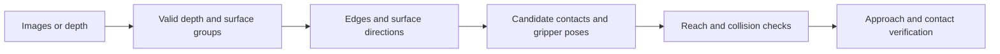

# Depth and Grasp Candidates

A camera image locates visible features in pixels. A robot also needs geometric information to decide where its fingers can approach and make contact.

## Stereo depth

Stereo uses two cameras with known relative geometry. **Correspondence** means identifying the same scene point in both images. After rectification aligns corresponding epipolar lines with image rows, horizontal disparity is $d=u_L-u_R$. For a standard rectified pinhole model with a positive disparity convention,

$$
Z=\frac{f b}{d},
$$

where $Z$ is depth along the camera axis, $f$ is focal length in pixels, and $b$ is baseline in meters. Pixels cancel, leaving meters. With $f=600$ px, $b=0.08$ m, and $d=40$ px, $Z=600(0.08)/40=1.2$ m.

Nearby points generally have larger disparity. Small disparity makes depth sensitive to pixel error: disparities of 39 and 41 px give approximately 1.231 and 1.171 m. Occlusion, reflections, and repeated or missing texture can prevent reliable matching. Zero or invalid disparity is not a finite valid depth estimate.

Epipolar geometry restricts where to search for a match. **RANSAC** repeatedly fits a model to small data subsets and looks for a large set of consistent observations; it can reject outliers but does not make an ambiguous match correct by itself.

## RGB-D and point clouds

RGB-D combines color imagery with depth measurements. Depth may be obtained through stereo, structured light, or time of flight, depending on the sensor. Color and depth pixels may require registration before they refer to the same scene points.

For optical-axis depth $Z$, calibrated camera coordinates follow from

$$
X=\frac{(u-c_x)Z}{f_x},\qquad Y=\frac{(v-c_y)Z}{f_y}.
$$

Here $(c_x,c_y)$ is the principal point and $f_x,f_y$ are focal lengths in pixels. For $u-c_x=100$ px, $f_x=500$ px, and $Z=1$ m, $X=0.2$ m. A point cloud collects such 3D points. Transform them into the robot's frame using the calibrated camera-to-robot relationship before planning motion.

## From visible geometry to a candidate grasp

One geometric pipeline groups similar depths or surface normals, finds depth discontinuities and image edges, estimates principal directions, then proposes opposing contact regions. A Canny edge detector finds image-intensity changes; these are not automatically object boundaries. Curvature and surface normals provide additional geometric cues. Pairwise checks can reject contacts whose separation exceeds the gripper opening or whose approach is obstructed.

A **6D gripper pose** specifies three position and three orientation freedoms. It is not six independent position coordinates. A surface pose can suggest an approach direction without identifying the entire object's pose. Depth-only segmentation can also be visualized with RGB colors without using those colors in the segmentation algorithm.

Research examples include [Jabalameli and Behal's depth-image grasp-pose work](https://doi.org/10.3390/robotics8030063) and [Roberts, Jabalameli, and Behal's surface-pose estimation framework](https://www.mdpi.com/2218-6581/11/1/7). These connect surface estimation to grasping; a candidate still requires robot-specific execution and contact checks.

## Quick reference

- Disparity is an image displacement; depth is a physical distance.
- Segmentation groups measurements; grasp selection adds tool and task constraints.
- A rectangle drawn on an image is a proposal, not proof of a stable grasp.
- Record invalid depth and uncertainty rather than silently treating them as free space.

[Section index](README.md) · [Next: Visual servoing](02-visual-servoing.md)
