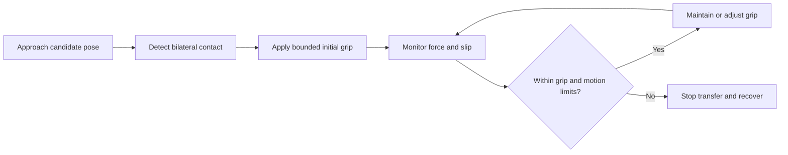

# Adaptive Grasping

A force that holds a filled container may deform an empty one. A grasp controller must consider both slipping and excessive compression, rather than choosing one closing command for every object.

## A simple friction model

Assume a vertical object is held by two opposing fingers, each applying equal normal force $N$. Assume a static load, equal friction coefficient $\mu$ at both contacts, and no other support. Each contact can supply at most $\mu N$ upward friction, so holding weight $W$ requires

$$
2\mu N\geq W,\qquad N\geq\frac{W}{2\mu}.
$$

For $W=2$ N and $\mu=0.4$, each finger needs at least $2/(2\times0.4)=2.5$ N in this ideal model. If total normal grip force is defined as $F_g=2N$, the same bound is $F_g\geq W/\mu=5$ N. Always state whether “grip force” means per-finger force or their sum.

Acceleration, unequal contacts, uncertain friction, torque balance, and deformation can invalidate this simple bound. It also gives no crushing threshold. If the minimum force needed to prevent slip exceeds the tolerated compression, change the grasp, support, or motion rather than merely increasing force.

## Contact acquisition and adaptation

The target force can be computed online using estimates of load, friction, and slip instead of being fixed before the grasp. A low-level force loop then tracks that changing target. Updating a target from slip evidence is distinct from simply tracking one constant force.

An illustrative bounded update is

$$
F_{d,k+1}=\operatorname{clip}(F_{d,k}+k_s\max(0,v_{\mathrm{slip},k}-v_0)\Delta t,
F_{\min},F_{\max}).
$$

Here $F_d$ denotes desired total normal grip force, slip speed is nonnegative, $v_0$ is a noise threshold, and $k_s$ has units N/m. This teaching rule increases the target when slip exceeds the threshold. It provides no general stability or minimum-force guarantee and does not automatically reduce force when the load decreases.

For $F_{d,k}=4$ N, $k_s=100$ N/m, slip speed 0.01 m/s, $v_0=0.002$ m/s, and $\Delta t=0.02$ s, the increase before clipping is $100(0.008)(0.02)=0.016$ N. Saturation means the target stays within its configured bounds; persistent slip at the upper bound requires another action.

Formal adaptive methods can estimate unknown quantities and establish properties under explicit assumptions. See the primary research record for [adaptive gripping with minimal grasping force](https://stars.library.ucf.edu/scopus2015/8862/). An experimental result or an algorithm name alone does not establish its behavior for a different gripper or object.

## Quick reference

- Establish contact before interpreting grip-force feedback.
- Slip feedback supplies information that normal-force magnitude alone lacks.
- Separate force-target adaptation from force-target tracking.
- Account for both insufficient force and excessive compression.

[Previous](03-tactile-and-slip-sensing.md) · [Section index](README.md) · [Next: Learning from demonstrations](05-learning-from-demonstrations.md)
