# Robotics: From Systems to Motion

Learn how robotic systems are built, how their mechanisms move, and how to predict that motion mathematically. The material starts with physical intuition and develops the tools needed to approach simulation and hardware with understanding.

## Start here

Read the sections in order on a first pass. Each section contains lessons, practice problems, and separate worked solutions. No robot hardware or simulator is required.

| Section | What you will learn | Starting knowledge |
| --- | --- | --- |
| [01 · Robotics foundations](01-robotics-foundations/README.md) | Identify system components, distinguish robots from manipulators, and describe autonomy and performance | None |
| [02 · Manipulators and motion](02-manipulators-and-motion/README.md) | Describe joints, DOF, configurations, performance, and tool selection | Section 01; basic algebra |
| [03 · Kinematics foundations](03-kinematics-foundations/README.md) | Use frames, forward/inverse kinematics, velocity Jacobians, and singularity analysis | Section 02; sine, cosine, and basic matrix multiplication |
| [04 · Control and interaction](04-control-and-interaction/README.md) | Understand feedback, contact control, actuators, dynamics, and collaborative operation | Sections 01–03 |
| [05 · Perception and autonomous grasping](05-perception-and-autonomous-grasping/README.md) | Connect depth, visual servoing, tactile sensing, adaptive grip, and demonstrations | Sections 03–04 |
| [06 · Robot programming](06-robot-programming/README.md) | Teach motions, prepare programs offline, and define execution and failure logic | Sections 03–05 |

The equations use SI units and radians unless an example explicitly uses degrees. Coding examples use descriptive variable names. The optional Python example uses only the standard library.

## How to study

1. Read a lesson and sketch the mechanism or system it describes.
2. Predict what should happen before substituting numbers into an equation.
3. Work through the section exercises before opening the solutions.
4. Check units, coordinate frames, and limiting cases in every calculation.
5. Explain what the model leaves out before applying it to a real robot.

A recurring example is a robot that picks up an object and places it elsewhere. We identify its components, model its motion, then examine how sensing and feedback support approach, contact, and grasping.

## The learning path

```mermaid
flowchart LR
    A[Robot systems] --> B[Links and joints]
    B --> C[Configuration and workspace]
    C --> D[Coordinate frames]
    D --> E[Forward kinematics]
    E --> F[Inverse kinematics]
    F --> V[Velocity kinematics]
    V --> G[Control and interaction]
    G --> H[Perception and grasping]
    H --> I[Learning from demonstrations]
    I --> J[Robot programming]
```

